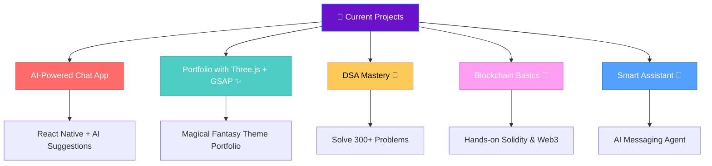

<!-- Animated Header -->

# 🚀 Welcome to Pravinsingh's Magical Code Realm! ✨

<div align="center">
  
</div>
<div align="center">
  
</div>

---

## 🧑‍🚀 About Me

<div align="center">
  
</div>

```javascript
const pravin = {
    location: "Pune, India 🇮🇳",
    education: "B.E. Electronics & Telecommunication",
    cgpa: "9.45/10 🎯",
    currentMission: "AI-Powered Assistants & Smart Apps",
    funFact: "I lift weights at gym & bugs in code 🏋️‍♂️🐛",
    motto: "Turn coffee ☕ into magical code ✨"
};

console.log("Welcome to my magical dev realm! 🪄");
```

<div align="center">
  
</div>

## 🛠️ My Dev Arsenal

<div align="center">
  
</div>

<div align="center">

### 🎨 Frontend Magic

<br/>

### ⚙️ Backend Power


### 🤖 AI/DSA & Languages


### 🛠️ Tools & Platforms


</div>

<div align="center">
  
</div>

## 🎯 Featured Projects

<div align="center">
  
</div>

<div align="center">

<table>
<tr>
<td align="center" width="50%">
<h3>🎬 BumbleMovie</h3>

<p><em>Movie app with React Native & TMDB API</em></p>
<p>Expo • NativeWind • Search</p>
<a href="https://github.com/Pravinrathod3/Movies-App">🔗 View Code</a>
</td>
<td align="center" width="50%">
<h3>🛍️ Auroro E-Commerce</h3>

<p><em>Full-stack store with React & Appwrite</em></p>
<p>Tailwind • Zustand • Authentication</p>
<a href="https://aurorashope.netlify.app/">🌐 Live Demo</a>
</td>
</tr>
<tr>
<td align="center" width="50%">
<h3>🤖 Finally Placed</h3>

<p><em>AI-Powered Placement Assistant (Hackathon Winner)</em></p>
<p>React • Node • Gemini API</p>
<a href="https://dev-clash-hackathon.vercel.app/">🌐 Live Demo</a>
</td>
<td align="center" width="50%">
<h3>📝 Blog Platform</h3>

<p><em>Full-stack blogging platform</em></p>
<p>Node.js • Express • PostgreSQL</p>
<a href="https://github.com/Pravinrathod3/Blog">🔗 View Code</a>
</td>
</tr>
</table>

</div>

## 📊 My Coding Universe

<div align="center">
  
</div>

<div align="center">
  
  
</div>

<div align="center">
  
</div>

<div align="center">
  
</div>

## 🎯 Current Missions

<div align="center">
  
</div>

<div align="center">



</div>

## 🏆 Achievements & Magic Spells

<div align="center">
  
</div>

<div align="center">

| Achievement | Status | Magic Level |
|:---:|:---:|:---:|
| 🥉 **Hackathon Winner** | 3rd Place in 7-hour Hackathon | ⭐⭐⭐ |
| 🎯 **Academic Excellence** | Top 5% of Batch (CGPA: 9.45) | ⭐⭐⭐⭐⭐ |
| 📜 **Postman API Expert** | Certified API Wizard | ⭐⭐⭐⭐ |
| 🔥 **DSA Champion** | 300+ Problems Conquered | ⭐⭐⭐⭐ |
| 💻 **Full-Stack Wizard** | Complete Web Development | ⭐⭐⭐⭐⭐ |
| 🏛️ **Leadership** | ENTC Club Secretary | ⭐⭐⭐⭐ |

</div>

## 🎮 Fun Zone

<div align="center">
  
</div>

<div align="center">


<br/>
<em>Each green square is a spell cast in my dev journey! ✨</em>

</div>

### 💭 Dev Philosophy & Wisdom

<div align="center">

> *"Code is like magic – the more you practice, the stronger the spells."* ✨  
> *"Every bug is just a misunderstood feature waiting for love."* 🐛❤️  
> *"Dream in algorithms, live in code."* 💻🌌  


</div>

<div align="center">
  
</div>

## 🌐 Connect With Me

<div align="center">
  
</div>

<div align="center">

<p>
<a href="https://linkedin.com/in/pravinrathod3">
  
</a>
<a href="https://leetcode.com/pravin-53_62">
  
</a>
<a href="https://codechef.com/users/solid_shade_16">
  
</a>
<a href="mailto:pravinrathod4532@gmail.com">
  
</a>
</p>

<div align="center">
  
</div>

</div>

---

<div align="center">

### 🌟 Thanks for visiting my magical dev realm!  
 <em><b>Let's connect and build something extraordinary together!</b> 🚀</em>

<br/>


<!-- Animated Footer -->


</div>
